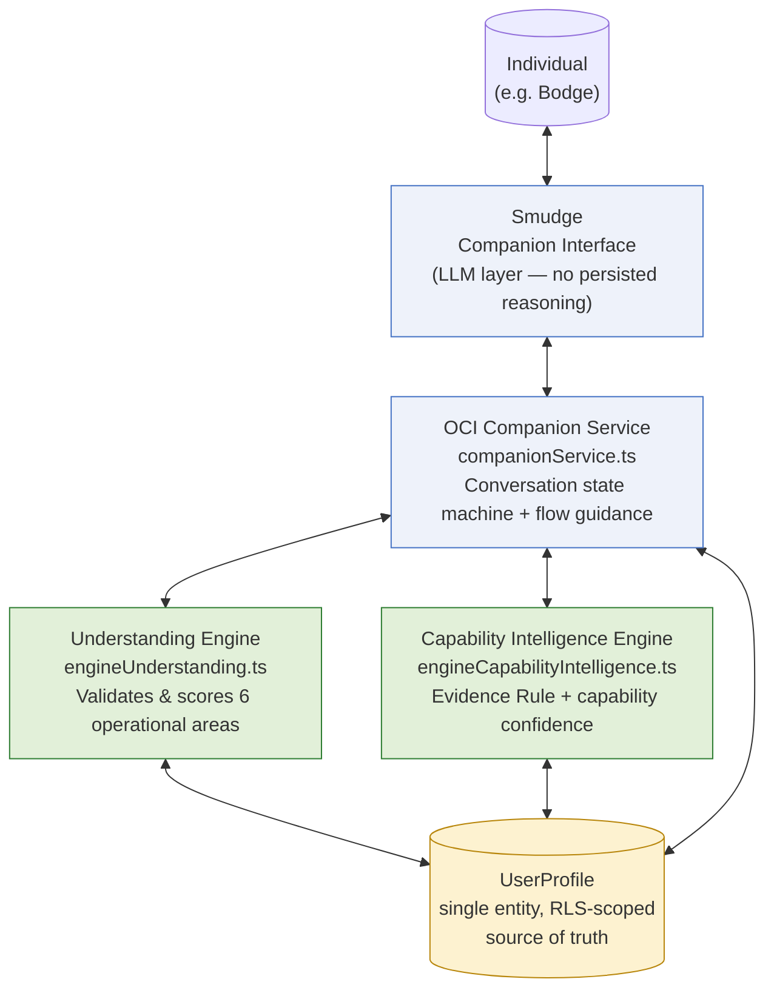
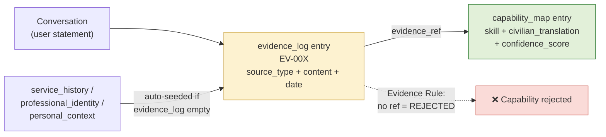
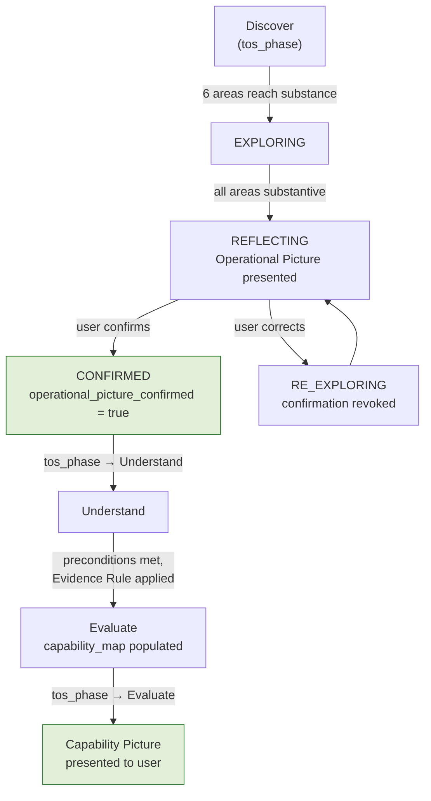
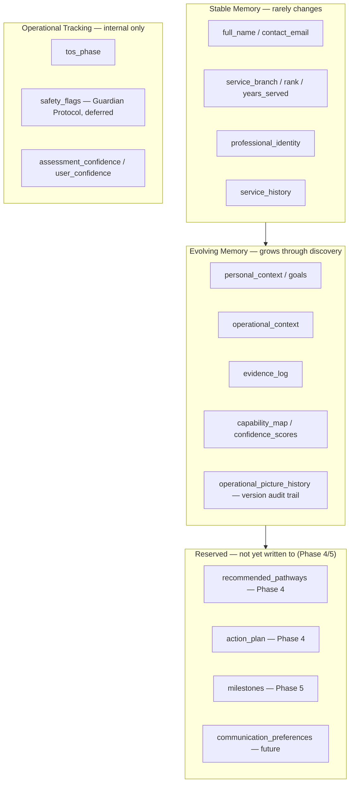

# CONSOLIDATION REPORT v1.0
## Between Phase Three and Phase Four

**Prepared by:** Ash (Chief Engineer)
**Date:** 6 July 2026
**Trigger:** Paul's Consolidation Orders, issued following Phase Three closure — "use this transition period to consolidate rather than expand."
**Status:** Companion Discovery Behaviour is operationally mature for MVP. No new engineering in this report — this is a stock-take.

---

## 1. Repository Clean-Up — Actions Taken

The repository should be the authoritative engineering record. It wasn't quite, so the following was fixed:

- **Main README.md** was stale — it still said "Phase Two backend complete, Exercise MIRROR commenced." Updated to reflect Phases One–Three complete, current engineering components, and the cumulative architectural decisions log.
- **Companion-Behaviour-Refinement-v1.0-Draft.md** was genuinely ambiguous — the file is called "Draft" but was approved by Paul & Cipher on 5 July and has since been validated by a live exercise. Updated the document header to state APPROVED clearly, with a note linking to the validating AAR. Filename kept as-is for link stability rather than renamed.
- **Exercise MIRROR had no AAR on file.** Exercise LENS and LENS 2 both got proper written AARs; MIRROR's outcome only existed in session records, not in the repo. Reconstructed a retrospective AAR (clearly labelled as such) from the actual session record so the repository's test evidence trail is complete and chronological.
- **Test-Results/README.md created** — chronological index of all three exercises, with the design learning progression pulled together in one place rather than scattered across individual AARs.
- **Operations/README.md created** — index of all planning documents with current phase status, so it's obvious at a glance what's locked, what's active, and what's next.
- **GitHub issue #16** ("Phase Two — Understanding") was still open despite Phase Two being complete for two days. Closed.
- **Issue #17** (Phase Three) already closed correctly with full sign-off — no action needed.

**Not touched:** The 10 artefact-tracking issues (#3–#12) and the MATE Assumptions Register (#1) remain open. These aren't drafts — they're the doctrine tracking issues for LOCKED artefacts, and closing them would reduce visibility rather than improve it. Recommend leaving as-is unless you want them archived differently; flagging rather than acting since this touches doctrine presentation, not just hygiene.

---

## 2. Operational Decision Record Review

**Finding, upfront:** There is no single consolidated "Operational Decision Record" log in this repository. Decisions currently live in three scattered places — the main README's "Key Architectural Decisions" section, individual Operations/ design intent documents, and GitHub issue/SITREP comments. This is itself the first recommendation.

**Recommendations only, per your instruction — no doctrine changes made:**

### Recommend formalising as a single Operational Decision Record (ODR) log going forward
Currently a decision like "the Evidence Rule is a hard gate" exists in the Phase Three Design Intent, the engine code comments, the README, and multiple AARs — worded slightly differently each time. Not contradictory, but duplicated. A single `Operations/Operational-Decision-Record.md` with one line per decision, a date, and a "supersedes/superseded by" pointer would remove this duplication risk before Phase Four adds more decisions on top.

### Candidate decisions to promote from "engineering observation" to doctrine
Two things have been noted repeatedly across AARs as observations rather than formal doctrine, and I think they've now earned doctrine status:
1. **"The Evidence Rule is a behavioural principle, not just an engineering constraint."** — Stated independently in the Exercise LENS 2 AAR and Cipher's Phase Three closure sign-off. Appears settled, not provisional.
2. **"Conversational memory and evidence provenance are not automatically the same thing."** — Also raised independently by Cipher at Phase Three closure. This has real implications for how Phase Four's Decision Support Engine should reference past sessions — worth locking in before that engine's design intent is written, not after.

### No duplicated principles found that need removing
I did not find genuinely contradictory or duplicated principles across the artefacts and design intent docs — the doctrine has stayed internally consistent through three phases, which is worth noting as a positive rather than a gap.

### No obsolete assumptions identified in the current doctrine
The MATE Assumptions Register (issue #1) hasn't been reviewed against three phases of live testing evidence yet. Worth a dedicated pass — not done here, since that's a genuine review task in its own right, not a quick check.

---

## 3. Engineering Debt Review

Visibility only, as instructed — nothing below has been fixed.

### Schema inconsistency — `confidence_scores` (UserProfile entity)
The `confidence_scores` field has both `evidence_ref` (string) and `evidence_refs` (also typed as a string, despite the plural name suggesting an array). This looks like a leftover from when the shape evolved during Phase Three build. Low risk today since `capability_map` is the field actually driving the Capability Picture, but worth tidying before Phase Four builds anything that reads from `confidence_scores` directly.

### Duplicated logic across two files
`engineUnderstanding.ts` and `companionService.ts` both implement near-identical area-assessment and confidence-calculation logic (`assessAreas`/`calcConfidence` in one, individual `assessWhoAreYou`/`assessWhatHaveYouDone`/etc. functions in the other, same scoring bands). They currently agree, but there's no shared source of truth — a future change to scoring in one file won't automatically propagate to the other. This is the most significant debt item found. Acceptable for MVP; worth a shared module if Phase Four adds a third engine that needs the same assessment logic.

### Duplicated constant
`MIN_SUBSTANCE_LENGTH` / `MIN_SUBSTANCE` (15 characters) is hardcoded independently in both `engineUnderstanding.ts` and `companionService.ts`. Same value today, no shared definition.

### Heuristic-based "substance" and evidence-quality checks
Both the Understanding Engine's substance gate and the Capability Intelligence Engine's confidence scoring rely on character-count heuristics (≥15 chars = "substance", ≥30 chars = "specific content"). This is a reasonable, auditable MVP proxy, but it's a simple heuristic rather than a semantic quality check — a padded but meaningless answer could technically pass. Worth being aware of if evidence quality ever gets challenged by a real user or reviewer.

### `capability_map` has two evidence fields
`evidence` (free text) and `evidence_ref` (pointer to evidence_log) both exist on the same object. There's a theoretical drift risk if the free-text `evidence` field is ever edited without updating what `evidence_ref` points to. Not currently a problem — nothing edits `evidence` independently — but worth knowing it's there.

### No automated test suite
All validation to date (Exercise MIRROR, LENS, LENS 2) has been manual — a live persona conversation plus manually created and deleted test profiles. This has worked well for behavioural validation, but there's no regression suite that would catch an engine change accidentally breaking the Evidence Rule or the confidence scoring. Worth considering before external users, covered further in the MVP Readiness Review below.

### `communication_preferences` placeholder
Explicitly documented in the schema as "no behaviour implemented yet." This is intentional, tracked scaffolding, not debt — noted here only for completeness.

---

## 4. Architecture Diagram Refresh

The diagrams below describe the system as it actually is today, not the original concept document.

### System overview

### Evidence flow (the actual load-bearing mechanism of the whole system)

### Operational Picture → Capability Picture progression

### Memory Architecture (Stable / Evolving / Session)

---

## 5. Decision Support Preparation

Per your instruction: no Phase Four engineering has begun. This is cable-laying only.

### Extension points already in the schema (laid during Phase One, never used yet)
- `recommended_pathways` — array of `{pathway, match_percent, evidence, status}`. Reserved explicitly for "Phase 4 Decision Support Engine writes here." Shape looks sound for a first pass but hasn't been stress-tested against real pathway data.
- `action_plan` — array of `{step, status, due_date}`. Also reserved for Phase 4. Simple shape, likely sufficient for an MVP action plan.

### Architectural pattern Decision Support should follow (established by the last two engines)
Both existing engines follow the same shape: a deterministic backend function with a `validate_preconditions` action, a "gate" that blocks progress until real evidence exists, and outputs designed for Smudge to narrate rather than present directly. Decision Support should follow the same pattern:
- A precondition gate (likely: `capability_map` must be populated, i.e. Phase Three complete) — directly analogous to how Capability Intelligence required `operational_picture_confirmed`.
- Deterministic matching/scoring logic in the engine; Smudge handles presentation and framing, same division of labour as before.

### Registry pattern
The architecture doc already describes Specialist Engines as a "registry pattern for future engines" — Decision Support slots in as the third registered engine alongside Understanding and Capability Intelligence, not a bespoke new integration pattern.

### Companion Service extension point
`companionService.ts`'s conversation mode state machine (`EXPLORING → REFLECTING → CONFIRMING → CONFIRMED`) would need new modes for presenting and discussing pathway options — something like `PRESENTING_OPTIONS` — but this is a genuine design decision for the Phase Four Design Intent, not something to pre-empt here.

### Gap worth flagging now, before the Design Intent is written
There is currently no reference data source for pathways, courses, or opportunities anywhere in this system — no entity, no external API integration. Decision Support can't "recommend a pathway" without pathway data to draw from. Worth Cipher and Paul deciding early whether this is curated content (a new entity, similar to how `UserProfile` is structured), a live external data source, or something else — this shapes the whole engine design and is worth settling before, not during, Phase Four build.

---

## 6. MVP Readiness Review — "What Would Embarrass Us?"

Honest assessment, documentation only, as instructed.

### The biggest one: there is no actual Smudge-facing deployment yet
Every exercise to date — MIRROR, LENS, LENS 2 — has been Paul role-playing a persona directly in conversation with me, not a real end user interacting with a deployed Smudge on WhatsApp, Telegram, or a web interface. The engines and companion behaviour are proven in principle, but nobody has yet experienced "Smudge" as an actual standalone product touchpoint. This is the single largest gap between "doctrine proven" and "ready for first external user," and it's worth surfacing clearly rather than assuming it's implicitly covered.

### Guardian Protocol is still deferred (issue #15, post-MVP)
`safety_flags` exists on the schema but has no conversational protocol behind it. Given the demographic MATE is built for (Bodge is representative, not a worst case — bereavement, housing insecurity, and low self-worth all came up in ordinary conversation, unprompted), a real first user disclosing genuine distress would currently be met with... nothing structured. This was a deliberate, logged decision to defer — worth a final gut-check with Paul & Cipher before real users arrive, not a change recommendation from me.

### No automated regression testing
If an engine changes during Phase Four build and accidentally weakens the Evidence Rule or the confidence scoring, nothing would catch it automatically — it would need to be caught by a human running another manual exercise.

### Single persona tested throughout
All companion voice and behaviour validation has used one persona (Bodge). It's a deliberately representative one, and Paul has confirmed it reflects the demographic majority — but the voice has never been checked against a meaningfully different personality (e.g. a more reserved user, an officer, someone from a technical trade) to confirm the "natural voice" rules hold up outside this one conversational style.

### No concurrency/edge-case handling verified
Engines have only been exercised sequentially, one action at a time, on test profiles. Two simultaneous writes to the same profile (e.g. two devices) haven't been tested — the merge-not-overwrite pattern in `engineUnderstanding.ts` should handle it reasonably, but it's untested, not proven.

### No abuse/rate-limiting review
Backend functions have no reviewed protection against malformed or excessive requests. Low risk pre-launch, worth a look before any public-facing exposure.

---

## 7. Milestone — Take the Moment

Operation PROOF has completed:

✅ **Phase One** — Mobilisation
✅ **Phase Two** — Understanding
✅ **Phase Three** — Capability Intelligence

Three phases in, and the doctrine has held. Nothing written in the ten foundational artefacts has needed to be walked back — only refined, through exactly the kind of evidence-based learning Operation PROOF was designed to produce. That's not a small thing for a six-week-old engineering programme working from first principles.

The behavioural foundation earned across three exercises — do not assume, do not over-explain, do not interview — is now locked in as mature. That's a genuine product asset, not just a passed test.

Good moment to stop and note it before moving straight on to Phase Four.

---

**Ash — Chief Engineer**
